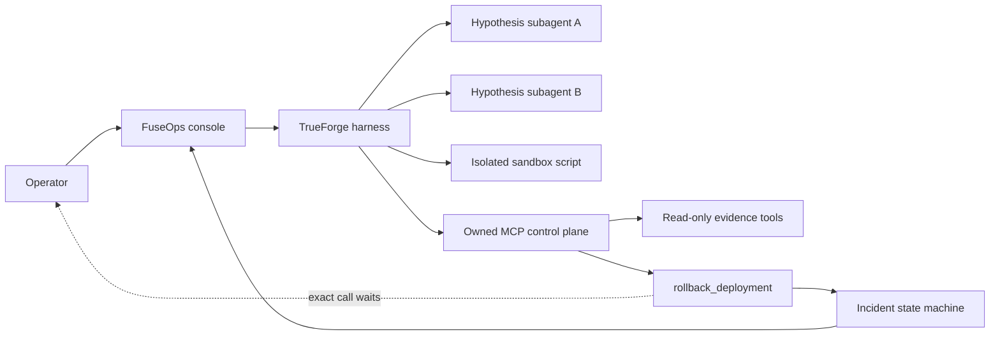

# FuseOps

**The incident agent that earns permission to act.**

FuseOps investigates a simulated checkout outage, correlates evidence across an owned MCP control plane, uses TrueForge subagents and a sandbox to challenge its diagnosis, and stops at the exact boundary where a person must approve a rollback.

Built for [The Agent Harness Hackathon](https://www.wemakedevs.org/hackathons/trueforge).

## Why it matters

Production incidents force operators to choose between speed and control. Most agent demos either stop at a recommendation or give the model broad credentials. FuseOps demonstrates a safer middle: autonomous diagnosis, explicit evidence, a tightly scoped action, and human authority over the consequential step.

The included scenario is deterministic and uses no customer data or cloud credentials. The rollback mutates an owned local simulator only.

## The three-minute story

1. A checkout deploy is followed by an 18.4% error rate and 2.1 second p95 latency.
2. The TrueForge agent reads the incident, health, deploy history, sanitized logs, and runbook through six real MCP tools.
3. It delegates competing hypotheses and runs a correlation script in the TrueForge sandbox.
4. Evidence converges on `checkout-v43` / commit `4c21f0a`.
5. TrueForge pauses `rollback_deployment` and exposes its exact arguments for human review.
6. After approval, the simulator atomically restores `checkout-v42`; the dashboard reports 1.2% errors and a resolved incident.

## Architecture



TrueForge remains visible and central: its local web client is embedded directly, while a narrow same-origin proxy performs the readiness check and the left-side flight recorder makes agent actions legible at a glance. A clearly labeled, credential-free replay is included for reliable judging; it never claims a model is running.

## Sponsor-tool proof

- **TrueForge:** durable agent manifest, dynamic subagents, sandboxed correlation, MCP orchestration, generative UI support, and a human approval checkpoint.
- **Owned MCP server:** five read-only evidence tools and one destructive, idempotent rollback tool using Streamable HTTP.
- **Qodo:** all substantive project code is prepared as one feature-branch PR. The required completed review trail is the final account-owned build step.

The destructive tool advertises `readOnlyHint: false` and `destructiveHint: true`. The TrueForge manifest independently requires approval for `rollback_deployment`; the tool also validates the incident and active deployment and is idempotent after success.

## Qodo Code Review Evidence

**Required before submission:** replace `QODO_REVIEWED_PR_URL` with the public URL of the representative merged PR containing the FuseOps implementation.

Qodo surfaced **`QODO_FINDING_SUMMARY`**. We **`QODO_DECISION_AND_CHANGE`**. The PR history must show the initial review, our response or reasoned dismissal, the resulting code update, and a follow-up Qodo review against the final code.

## Run locally

### Requirements

- Node.js 22.14 or newer
- A model provider supported by TrueForge, or a local OpenAI-compatible provider such as Ollama
- TrueForge standalone v0.1.4 or newer

### 1. Install and verify

```bash
npm install
npm run check
```

`npm run check` type-checks both apps, runs 12 tests, and creates production builds.

### 2. Start FuseOps

```bash
npm run dev
```

Open [http://127.0.0.1:4173](http://127.0.0.1:4173). The credential-free replay works immediately. The owned control plane runs at `http://127.0.0.1:3100`, with MCP at `/mcp`.

### 3. Start and configure TrueForge

In another terminal:

```bash
NPM_CONFIG_CACHE=/tmp/fuseops-npm-cache npx --yes @truefoundry/trueforge@latest --port 8790
```

In TrueForge settings:

1. Configure your model provider and copy its exact model FQN.
2. Add an HTTP MCP server named `fuseops-control-plane` with URL `http://localhost:3100/mcp`; no auth is required locally.
3. Register the FuseOps agent:

```bash
TRUEFORGE_MODEL=your-provider/your-model npm run agent:register
```

For the locally verified configuration, Ollama exposed `qwen3:14b` at `http://localhost:11434/v1` and the agent used `ollama-local/qwen3-14b`.

Switch the console to **Live harness**, select **FuseOps Commander** if needed, reset the scenario, and paste the prompt produced by **Copy demo prompt**.

## Useful commands

```bash
npm run typecheck       # TypeScript checks
npm test                # 12 safety and replay tests
npm run build           # Production builds
npm run check           # All of the above
npm run agent:preview   # Print the resolved manifest without registering
```

## Safety model

- Read-only evidence gathering comes first.
- The agent is instructed to distinguish observations from inference.
- The sandbox receives synthetic incident data, not production credentials.
- Only the exact implicated active deployment can be rolled back.
- A malformed, stale, or wrong-deployment action fails closed.
- A successful retry is idempotent and cannot apply a second rollback.
- The audit trail records investigation, approval boundary, mutation, and recovery.

## Repository map

```text
apps/console/          Responsive React operator console and replay
apps/control-plane/    Incident state machine, HTTP API, and MCP server
config/                Auditable TrueForge agent manifest
scripts/               Idempotent local registration utility
docs/                  Scope, PRD, architecture, checklist, demo, and PR packet
```

## Honest limitations

- FuseOps is a local, single-incident safety demonstrator, not a production orchestrator.
- The simulator deliberately avoids live cloud and payment credentials.
- TrueForge standalone is for local use and should not be exposed to the public internet.
- Provider and sandbox availability depend on the judge's local TrueForge setup; replay mode remains fully evaluable without them.

## AI assistance disclosure

Codex helped research the event, shape the scope, write the implementation and tests, verify the UI, and draft submission materials. TrueForge is the runtime agent harness demonstrated by the product. All generated work was locally checked through tests, builds, MCP contract calls, and browser review.

## License

MIT — see [LICENSE](LICENSE).
