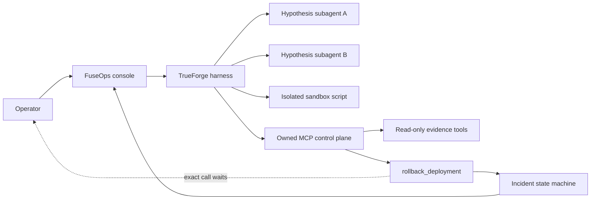

# FuseOps

**The incident agent that earns permission to act.**

FuseOps investigates a simulated checkout outage, correlates evidence across an owned MCP control plane, uses TrueForge subagents and a sandbox to challenge its diagnosis, and stops at the exact boundary where a person must approve a rollback.

Built for [The Agent Harness Hackathon](https://www.wemakedevs.org/hackathons/trueforge).

## Why it matters

Production incidents force operators to choose between speed and control. Most agent demos either stop at a recommendation or give the model broad credentials. FuseOps demonstrates a safer middle: autonomous diagnosis, explicit evidence, a tightly scoped action, and human authority over the consequential step.

The included scenario is deterministic and uses no customer data or cloud credentials. The rollback mutates an owned local simulator only.

## The three-minute story

1. A checkout deploy is followed by an 18.4% error rate and 2.1 second p95 latency.
2. The TrueForge agent reads the incident, health, deploy history, sanitized logs, and runbook through five read-only MCP tools; a sixth tool is reserved for the guarded rollback.
3. It delegates competing hypotheses and runs a correlation script in the TrueForge sandbox.
4. Evidence converges on `checkout-v43` / commit `4c21f0a`.
5. TrueForge pauses `rollback_deployment` and exposes its exact arguments for human review.
6. After approval, the simulator atomically restores `checkout-v42`; the dashboard reports 1.2% errors and a resolved incident.

## Architecture



TrueForge remains visible and central: its local web client is embedded directly, while a narrow same-origin proxy performs the readiness check and the left-side flight recorder makes agent actions legible at a glance. A clearly labeled, credential-free replay is included for reliable judging; it never claims a model is running.

## Sponsor-tool proof

- **TrueForge:** durable agent manifest, dynamic subagents, sandboxed correlation, MCP orchestration, generative UI support, and a human approval checkpoint.
- **Owned MCP server:** five read-only evidence tools and one destructive, idempotent rollback tool using Streamable HTTP.
- **Qodo:** the public rollback-hardening PR preserves Qodo's initial findings, our decisions, the remediation commit, and follow-up review.

The destructive tool advertises `readOnlyHint: false` and `destructiveHint: true`. The TrueForge manifest independently requires approval for `rollback_deployment`; the tool also validates the incident and active deployment and is idempotent after success.

## Qodo Code Review Evidence

**Status: review complete.** [PR #1](https://github.com/amithrh/fuseops-trueforge/pull/1) is the representative rollback-domain hardening change. Qodo's [persistent review](https://github.com/amithrh/fuseops-trueforge/pull/1#issuecomment-5470750643) and [high-severity inline finding](https://github.com/amithrh/fuseops-trueforge/pull/1#discussion_r3890300787) identified that a retry with different canonical evidence could be accepted as an unchanged success, even though TrueForge approval applies to the exact tool arguments. We accepted the finding, bound resolved-state retries to the normalized evidence in the original `rollback.requested` audit event, added a conflicting-evidence regression test, and recorded the [remediation response](https://github.com/amithrh/fuseops-trueforge/pull/1#discussion_r3890304469). Qodo's follow-up marked that finding resolved and updated the review through commit `a42d383`.

Qodo later questioned the documented test count after omitting the four cases in `App.test.tsx`. We checked the actual Vitest output, retained the correct total of 23, clarified the four-file breakdown, and recorded the [evidence-based decision](https://github.com/amithrh/fuseops-trueforge/pull/1#discussion_r3890310416). The public thread therefore shows both outcomes: accepting and fixing a valid safety finding, and explaining a reasoned dismissal when the automated evidence was incomplete.

## Run locally

### Requirements

- Node.js 22.14 or newer
- A model provider supported by TrueForge, or a local OpenAI-compatible provider such as Ollama
- TrueForge standalone v0.1.4 (locally verified)

### 1. Install and verify

```bash
npm install
npm run check
```

`npm run check` type-checks both apps, runs 23 Vitest cases across four test files, and creates production builds.

### 2. Start FuseOps

```bash
npm run dev
```

Open [http://127.0.0.1:4173](http://127.0.0.1:4173). The credential-free replay works immediately. The owned control plane runs at `http://127.0.0.1:3100`, with MCP at `/mcp`.

### 3. Start and configure TrueForge

In another terminal:

```bash
NPM_CONFIG_CACHE=/tmp/fuseops-npm-cache npx --yes @truefoundry/trueforge@0.1.4 --port 8790
```

In TrueForge settings:

1. Configure your model provider and copy its exact model FQN.
2. Add an HTTP MCP server named `fuseops-control-plane` with URL `http://localhost:3100/mcp`; no auth is required locally.
3. Create or update the FuseOps agent (the command is safe to repeat):

```bash
TRUEFORGE_MODEL=your-provider/your-model npm run agent:register
```

For the locally verified configuration, native Ollama used Apple Metal on `http://127.0.0.1:11435/v1`, TrueForge registered that endpoint as `ollama-metal`, and the agent used `ollama-metal/qwen3-14b`. Port `11435` keeps this demo isolated when a Docker Ollama instance already owns the default `11434` port:

```bash
OLLAMA_HOST=127.0.0.1:11435 OLLAMA_KEEP_ALIVE=30m ollama serve
```

To reproduce that provider in **TrueForge Settings → Model providers**, use:

- Provider name: `ollama-metal`
- Base URL: `http://127.0.0.1:11435/v1`
- Model ID: `qwen3:14b`
- Display name: `qwen3-14b`
- Context length: `32768`
- Maximum output tokens: `3000`
- Advertised reasoning efforts: `none`

The resulting model FQN is `ollama-metal/qwen3-14b`. Advertising `none` is required for this checked-in manifest because TrueForge validates `reasoning_effort` against the provider metadata during registration.

The checked-in manifest sends `reasoning_effort: "none"`, which Ollama's OpenAI-compatible endpoint maps to thinking disabled, and caps each response at 3,000 tokens. This avoids Qwen's long optional reasoning trace while leaving enough space for the complete tool workflow. If another provider does not support that setting, remove it or select a model that advertises the corresponding reasoning capability before registration.

Switch the console to **Live harness**, open the embedded TrueForge agent library and select **FuseOps Commander**, reset the scenario, and paste the prompt produced by **Copy demo prompt**. The iframe starts at TrueForge's normal home screen, so selecting the saved agent is an explicit setup step.

### Verified live run

The complete TrueForge path passed locally on 2026-08-30 in session `01m19qc2w5b87hpa6z9dj0ds6y`:

- five initial root MCP evidence calls;
- exactly two dynamic subagents, limited to evidence review;
- one successful TrueForge sandbox command producing a 360-second deploy-to-incident interval and a 0.90 correlation score;
- one root `rollback_deployment` call paused at the real TrueForge approval card;
- no simulator mutation before Allow;
- approved rollback from `checkout-v43` to `checkout-v42`;
- post-action verification of 1.2% error rate, 312 ms p95 latency, and resolved incident status.

The run completed in 2 minutes 12 seconds including a 29-second human review at the approval card, and TrueForge recorded zero reasoning tokens. The earlier Docker-hosted CPU-only `qwen3:14b` attempt took 5 minutes 24 seconds without reaching a tool call; moving the same model to native Metal and using `reasoning_effort: "none"` resolved that runtime blocker. See [`outputs/LIVE_TEST_EVIDENCE.md`](outputs/LIVE_TEST_EVIDENCE.md) for the preserved verification summary.

## Useful commands

```bash
npm run typecheck       # TypeScript checks
npm test                # 23 cases across four safety, replay, and console test files
npm run build           # Production builds
npm run check           # All of the above
npm run agent:preview   # Print the resolved manifest without registering
```

## Safety model

- Read-only evidence gathering comes first.
- The agent is instructed to distinguish observations from inference.
- The sandbox receives synthetic incident data, not production credentials.
- Only the exact implicated active deployment can be rolled back.
- A malformed, stale, or wrong-deployment action fails closed.
- A successful retry is idempotent and cannot apply a second rollback.
- The audit trail records investigation, approval boundary, mutation, and recovery.

## Repository map

```text
apps/console/          Responsive React operator console and replay
apps/control-plane/    Incident state machine, HTTP API, and MCP server
config/                Auditable TrueForge agent manifest
scripts/               Idempotent local registration utility
docs/                  Scope, PRD, architecture, checklist, demo, and PR packet
```

## Honest limitations

- FuseOps is a local, single-incident safety demonstrator, not a production orchestrator.
- The simulator deliberately avoids live cloud and payment credentials.
- TrueForge standalone is for local use and should not be exposed to the public internet.
- Provider and sandbox availability depend on the judge's local TrueForge setup; replay mode remains fully evaluable without them.
- The verified live run used a host-native Metal runtime; other hardware/provider combinations should complete a fresh live smoke before recording.
- TrueForge standalone v0.1.4 emits non-blocking Monaco JSON-worker method errors while rendering its JSON approval viewer. They did not prevent the approval, rollback, or completed run, and they originate in the embedded upstream client rather than the FuseOps console.

## AI assistance disclosure

Codex helped research the event, shape the scope, write the implementation and tests, verify the UI, and draft submission materials. TrueForge is the runtime agent harness demonstrated by the product. All generated work was locally checked through tests, builds, MCP contract calls, and browser review.

## License

MIT — see [LICENSE](LICENSE).
